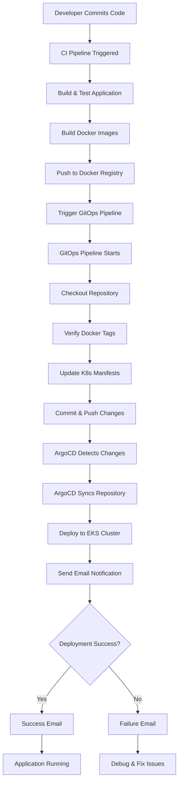

# GitOps Workflow Documentation 🔄

## 📊 Complete GitOps Workflow Diagram



## 🔄 Detailed Workflow Steps

### Phase 1: CI Pipeline (Build Phase)
```
┌─────────────────────────────────────────────────────────────┐
│                     CI Pipeline                             │
├─────────────────────────────────────────────────────────────┤
│ 1. Code Checkout                                            │
│ 2. Security Scans (OWASP, SonarQube, Trivy)              │
│ 3. Build Frontend & Backend                                 │
│ 4. Create Docker Images                                     │
│ 5. Push to Docker Registry                                  │
│ 6. Trigger GitOps Pipeline with Image Tags                 │
└─────────────────────────────────────────────────────────────┘
```

### Phase 2: GitOps Pipeline (Deploy Phase)
```
┌─────────────────────────────────────────────────────────────┐
│                   GitOps Pipeline                           │
├─────────────────────────────────────────────────────────────┤
│ 1. Receive Image Tags from CI                              │
│ 2. Checkout Repository                                      │
│ 3. Update Kubernetes Manifests                             │
│    ├── backend.yaml (Backend Image Tag)                    │
│    └── frontend.yaml (Frontend Image Tag)                  │
│ 4. Commit Changes to Git                                    │
│ 5. Push Updated Manifests                                   │
└─────────────────────────────────────────────────────────────┘
```

### Phase 3: ArgoCD Deployment
```
┌─────────────────────────────────────────────────────────────┐
│                  ArgoCD Deployment                          │
├─────────────────────────────────────────────────────────────┤
│ 1. Monitor Git Repository                                   │
│ 2. Detect Manifest Changes                                  │
│ 3. Sync with EKS Cluster                                    │
│ 4. Apply Updated Deployments                               │
│ 5. Health Check Applications                               │
└─────────────────────────────────────────────────────────────┘
```

## 🎯 Pipeline Execution Flow

### 1. Pipeline Trigger
```yaml
Trigger Method: Parameterized Build
Parameters:
  - FRONTEND_DOCKER_TAG: "v1.2.3"
  - BACKEND_DOCKER_TAG: "v1.2.3"
```

### 2. Manifest Update Process
```bash
# Backend Manifest Update
Original: image: wanderlust-backend-beta:v1.2.2
Updated:  image: wanderlust-backend-beta:v1.2.3

# Frontend Manifest Update  
Original: image: wanderlust-frontend-beta:v1.2.2
Updated:  image: wanderlust-frontend-beta:v1.2.3
```

### 3. Git Operations Timeline
```
Time    Action                          Status
00:00   Pipeline Started               ✅ Running
00:01   Repository Cloned              ✅ Success
00:02   Manifests Updated              ✅ Success
00:03   Changes Committed              ✅ Success
00:04   Pushed to GitHub               ✅ Success
00:05   Pipeline Completed             ✅ Success
```

## 📈 Integration Points

### CI to GitOps Integration
```groovy
// In CI Pipeline Jenkinsfile
stage('Trigger GitOps') {
    steps {
        script {
            build job: 'GitOps-Pipeline',
            parameters: [
                string(name: 'FRONTEND_DOCKER_TAG', value: "${BUILD_NUMBER}"),
                string(name: 'BACKEND_DOCKER_TAG', value: "${BUILD_NUMBER}")
            ],
            wait: false
        }
    }
}
```

### GitOps to ArgoCD Integration
```yaml
# ArgoCD Application Configuration
apiVersion: argoproj.io/v1alpha1
kind: Application
metadata:
  name: wanderlust
spec:
  source:
    repoURL: https://github.com/Sujal-SM/Wanderlust-Mega-Project.git
    path: kubernetes
    targetRevision: main
  syncPolicy:
    automated:
      prune: true
      selfHeal: true
    syncOptions:
    - CreateNamespace=true
```

## 🔍 Monitoring & Observability

### Pipeline Monitoring
```
Jenkins Dashboard:
├── Build History
├── Console Output
├── Pipeline Visualization
└── Email Notifications

ArgoCD Dashboard:
├── Application Status
├── Sync Status
├── Resource Health
└── Event History
```

### Key Metrics to Monitor
- **Pipeline Success Rate**: % of successful deployments
- **Deployment Frequency**: How often deployments occur
- **Lead Time**: Time from commit to production
- **Mean Time to Recovery**: Time to fix failed deployments

## 🚨 Error Handling & Recovery

### Common Failure Scenarios
```
1. Git Push Failure
   ├── Cause: Authentication issues
   └── Solution: Check GitHub credentials

2. Manifest Update Failure
   ├── Cause: File not found or sed syntax error
   └── Solution: Verify file paths and sed commands

3. ArgoCD Sync Failure
   ├── Cause: Invalid YAML or resource conflicts
   └── Solution: Validate manifests and check cluster resources
```

### Recovery Procedures
```bash
# Manual rollback if needed
kubectl rollout undo deployment/wanderlust-backend -n wanderlust
kubectl rollout undo deployment/wanderlust-frontend -n wanderlust

# Check deployment status
kubectl get deployments -n wanderlust
kubectl describe deployment wanderlust-backend -n wanderlust
```

## 📊 Success Metrics

### Deployment Success Indicators
- ✅ Pipeline completes without errors
- ✅ Git push successful
- ✅ ArgoCD sync successful
- ✅ All pods running and healthy
- ✅ Application accessible via LoadBalancer

### Performance Metrics
- **Build Time**: ~5-10 minutes
- **Deployment Time**: ~2-5 minutes
- **Total Lead Time**: ~7-15 minutes
- **Success Rate**: Target >95%

## 🔄 Continuous Improvement

### Optimization Opportunities
1. **Parallel Execution**: Run frontend/backend updates in parallel
2. **Caching**: Implement Git and Docker layer caching
3. **Testing**: Add automated deployment testing
4. **Monitoring**: Enhanced observability and alerting

### Future Enhancements
- Multi-environment support (dev, staging, prod)
- Blue-green deployment strategy
- Canary releases
- Automated rollback on failure detection